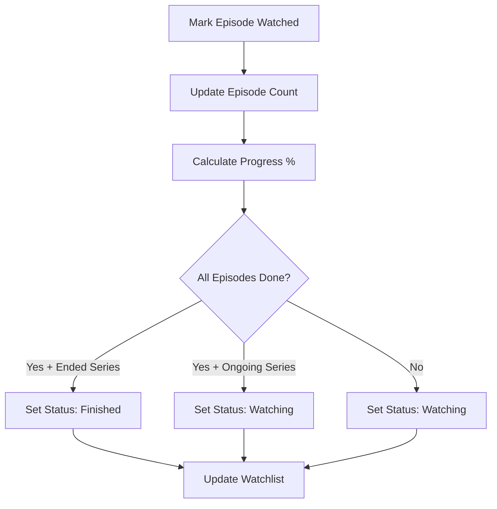

## Overview

Film Fanatic provides granular episode-level tracking for TV shows, allowing users to mark individual episodes as watched, track viewing progress, and automatically update show completion status.

## Episode Browser Interface

Location: `src/components/media/inline-episode-browser.tsx`

The episode browser appears on TV show detail pages and provides:

<CardGroup cols={2}>
  <Card title="Season Accordion" icon="list">
    - Collapsible season sections
    - Season metadata (episode count, air year)
    - Watch completion indicators
    - Batch mark all/unmark all buttons
  </Card>
  <Card title="Episode Cards" icon="tv">
    - Episode thumbnail stills
    - Title and air date
    - Episode ratings
    - Watch status toggle
    - Progress percentage
    - Expandable descriptions
  </Card>
</CardGroup>

## Season Display

### Season Accordion

Each season is displayed as an accordion item with:

<Tabs>
  <Tab title="Season Header">
    - **Season Number** - "Season 1", "Season 2", etc.
    - **Episode Count** - Badge showing total episodes
    - **Air Year** - First air date year
    - **Completion Badge** - "Seen" indicator if all episodes watched
    - **Progress Counter** - "X/Y watched" for partial completion
  </Tab>
  <Tab title="Season Actions">
    - **Mark All as Watched** - Batch operation to mark all episodes
    - **Unmark All as Watched** - Remove watched status from all episodes
    - **Expand/Collapse** - Show or hide episode list
  </Tab>
</Tabs>

### Special Seasons

Seasons are organized with main seasons first, then specials:
- **Main Seasons** - Season 1, 2, 3, ... (season_number > 0)
- **Specials** - Season 0 (bonus content, behind-the-scenes)

Implementation: `src/components/media/inline-episode-browser.tsx:52-55`

### Progressive Disclosure

To avoid overwhelming users:
- **First 3 seasons** shown by default
- **"View all X seasons"** button if more than 3 exist
- Clicking reveals all remaining seasons

Location: `src/components/media/inline-episode-browser.tsx:57-59`

## Episode Cards

### Episode Information Display

<CardGroup cols={3}>
  <Card title="Visual" icon="image">
    - Episode still/thumbnail
    - Hover play overlay
    - Fallback for missing images
  </Card>
  <Card title="Metadata" icon="info">
    - Episode number (E01, E02...)
    - Episode title
    - Air date
    - Runtime (if available)
    - Rating (TMDB score)
  </Card>
  <Card title="Status" icon="check">
    - Watch status badge
    - Progress percentage
    - Quick toggle button
  </Card>
</CardGroup>

### Episode Description

<Accordion title="Expandable Overviews">
  Long episode descriptions are truncated to 120 characters with a "Read more" button.
  
  Implementation: `src/components/media/inline-episode-browser.tsx:406-422`
  
  Features:
  - Hidden on mobile (sm breakpoint)
  - Expandable via "Read more" / "Show less" toggle
  - Graceful handling of missing descriptions
</Accordion>

### Watch Status Toggle

Each episode has a toggle button with two states:

<Tabs>
  <Tab title="Unwatched">
    - Eye icon (outline)
    - Gray border
    - Hover shows "Mark as watched"
    - Click marks episode as watched
  </Tab>
  <Tab title="Watched">
    - Checkmark icon (filled)
    - Green border and background
    - Shows "Seen" badge
    - Click unmarks episode
  </Tab>
</Tabs>

Location: `src/components/media/inline-episode-browser.tsx:315-361`

## Episode Watch Tracking

Location: `src/hooks/useWatchProgress.ts`

### Hook: useEpisodeWatched

```typescript
const episodeTracker = useEpisodeWatched(
  tvId,           // TMDB show ID
  totalEpisodes,  // Total episode count across all seasons
  showMeta        // Show metadata (title, image, etc.)
);
```

**Returns:**
- `isEpisodeWatched(season, episode): boolean`
- `toggleEpisodeWatched(season, episode): void`
- `markSeasonWatched(season, episodes[]): void`
- `unmarkSeasonWatched(season, episodes[]): void`
- `isSeasonFullyWatched(season, episodeCount): boolean`
- `getSeasonWatchedCount(season, episodeCount): number`
- `watchedCount: number` - Total episodes watched

### Data Storage

<Tabs>
  <Tab title="Anonymous Users">
    Stored in local state via `useLocalProgressStore`:
    
    ```typescript
    watchedEpisodes: {
      "12345:1:1": true,  // tvId:season:episode
      "12345:1:2": true,
      "12345:2:1": false,
    }
    ```
    
    Location: `src/hooks/useLocalProgressStore.ts`
  </Tab>
  <Tab title="Authenticated Users">
    Synced to Convex backend via `episode_progress` table:
    
    ```typescript
    {
      _id: Id<"episode_progress">,
      userId: Id<"users">,
      tmdbId: number,
      season: number,
      episode: number,
      isWatched: boolean,
      updatedAt: number
    }
    ```
    
    Backend: `convex/watchlist.ts:markEpisodeWatched`
  </Tab>
</Tabs>

## Batch Operations

### Mark Season as Watched

When a user clicks "Mark all as watched" for a season:

<Steps>
  <Step title="Generate Episode List">
    Create array of episode numbers [1, 2, 3, ..., episodeCount]
  </Step>
  <Step title="Batch Mutation">
    For authenticated users, single mutation marks all episodes.
    
    For local users, iterate and mark each episode in localStorage.
    
    Location: `src/hooks/useWatchProgress.ts:574-588`
  </Step>
  <Step title="Update Progress">
    Recalculate show-level progress percentage based on new watched count.
  </Step>
  <Step title="UI Update">
    Season header shows "Seen" badge, all episode cards show watched state.
  </Step>
</Steps>

### Unmark Season

Similar process in reverse:
1. Identify all watched episodes in the season
2. Batch remove watched status
3. Recalculate progress (may change to "watching" or "want-to-watch")
4. Update UI

Location: `src/hooks/useWatchProgress.ts:601-630`

## Progress Calculation

### Episode-Based Progress

TV show progress is calculated from watched episode count:

```typescript
const progress = Math.floor((watchedEpisodes / totalEpisodes) * 100);
```

Location: `src/hooks/useWatchProgress.ts:404-412`

### Auto-Status Updates

As users watch episodes, the show's progress status updates automatically:

<Tabs>
  <Tab title="Want to Watch">
    - 0 episodes watched
    - Progress: 0%
    - Status: `"want-to-watch"`
  </Tab>
  <Tab title="Watching">
    - 1+ episodes watched, but not all
    - Progress: 1-99%
    - Status: `"watching"`
  </Tab>
  <Tab title="Finished">
    - All episodes watched
    - Progress: 100%
    - Status: `"finished"`
    - **Only if series is ended/canceled**
  </Tab>
</Tabs>

<Note>
  For ongoing series (status: "Returning Series"), even with 100% of current episodes watched, the status remains "watching" since more episodes are expected.
</Note>

### Manual Status Override

Users can manually set status from the watchlist:
- Manual "finished" status is respected even if not all episodes watched
- Manual "watching" status persists even when 100% complete
- Progress percentage still updates based on actual episode counts

Location: `src/hooks/useWatchProgress.ts:433-459`

## Player Integration

Location: `src/hooks/useWatchProgress.ts:69-177`

### Auto-Mark on Completion

The `usePlayerProgressListener` hook listens for video player events:

<Steps>
  <Step title="Player Event">
    Video player sends postMessage events:
    - `play` - User starts playback
    - `timeupdate` - Progress during playback
    - `ended` - Video finished
    - `pause` - Playback paused
    - `seeked` - User skipped forward/backward
  </Step>
  <Step title="Progress Threshold">
    When progress reaches 95% or "ended" event fires:
    
    ```typescript
    if (playerEvent === "ended" || progress >= 95) {
      // Auto-mark episode as watched
    }
    ```
  </Step>
  <Step title="Episode Marked">
    Episode watch status is automatically updated:
    - For authenticated users: `markEpisodeWatched` mutation
    - For local users: Update local progress store
  </Step>
  <Step title="UI Refresh">
    Episode card and season header update to reflect watched state.
  </Step>
</Steps>

### Progress Persistence

Player events also save viewing progress:
- Saved every 2% of progress change
- Persisted for "Continue Watching" feature
- Resume playback from last position

Location: `src/hooks/useWatchProgress.ts:120-162`

## Season Watch Statistics

### Season Completion Badge

Location: `src/components/media/inline-episode-browser.tsx:125-132`

<Tabs>
  <Tab title="Fully Watched">
    Green "Seen" badge appears when:
    
    ```typescript
    isSeasonFullyWatched(seasonNumber, episodeCount) === true
    ```
    
    All episodes in the season have been marked watched.
  </Tab>
  <Tab title="Partially Watched">
    Text counter shows "X/Y watched" when:
    - At least 1 episode watched
    - Not all episodes watched
    
    Example: "5/10 watched"
  </Tab>
  <Tab title="Unwatched">
    No badge or counter shown when no episodes watched.
  </Tab>
</Tabs>

### Season Watch Count

```typescript
const watchedCount = episodeTracker.getSeasonWatchedCount(
  seasonNumber,
  totalEpisodesInSeason
);
```

Returns the number of watched episodes for a specific season.

Location: `src/hooks/useWatchProgress.ts:646-656`

## Optimistic UI Updates

For instant feedback, all episode tracking operations use optimistic updates:

<Tabs>
  <Tab title="Single Episode Toggle">
    1. UI updates immediately (checkmark appears/disappears)
    2. Mutation sent to backend
    3. On success: UI state confirmed
    4. On failure: UI reverts to previous state
    
    Location: `src/hooks/useWatchProgress.ts:296-332`
  </Tab>
  <Tab title="Batch Season Operation">
    1. All episode cards update instantly
    2. Season badge changes to "Seen" or removed
    3. Batch mutation sent to backend
    4. Success/failure handling
    
    Location: `src/hooks/useWatchProgress.ts:334-373`
  </Tab>
</Tabs>

## Episode Progress Percentage

Individual episodes can have partial progress:

```typescript
const progress = useEpisodeProgress(tvId, season, episode);
// Returns: 0-100 (percentage watched)
```

<CardGroup cols={2}>
  <Card title="Unwatched" icon="circle">
    Progress: 0%
    
    No badge shown
  </Card>
  <Card title="In Progress" icon="clock">
    Progress: 1-94%
    
    Yellow badge with percentage
  </Card>
  <Card title="Completed" icon="check">
    Progress: 95-100%
    
    Green "Seen" badge
  </Card>
</CardGroup>

Location: `src/hooks/useWatchProgress.ts:708-738`

## Episode Video Player Modal

Location: `src/components/video-player-modal.tsx`

Clicking an episode thumbnail opens a modal with:
- Embedded video player
- Episode title and metadata
- Auto-resume from last position
- Auto-play next episode (optional)
- Episode selector dropdown

Playback events are tracked and synced via `usePlayerProgressListener`.

## Continue Watching Feature

Location: `src/hooks/useWatchProgress.ts:204-228`

### Hook: useContinueWatching

```typescript
const { items } = useContinueWatching();
// Returns items with 0 < progress < 100
```

Shows in-progress content on the homepage:
- Movies with partial playback
- TV shows with episodes in progress
- Sorted by last updated

## Sync Between Progress and Status

### Automatic Synchronization

Episode tracking automatically updates show-level metadata:



Location: `src/hooks/useWatchProgress.ts:383-536`

### Conflict Resolution

<Warning>
  Manual "dropped" status is never auto-overridden by episode tracking. Users must manually change from "dropped" to another status.
</Warning>

Priority:
1. Manual "dropped" - Preserved regardless of episode watch count
2. Manual "watching" with 100% - Preserved (user may not consider it finished)
3. Auto-derived status - Calculated from episode count and series status

## API Reference

### Key Hooks

<CodeGroup>
```typescript useEpisodeWatched
const tracker = useEpisodeWatched(tvId, totalEpisodes, showMeta);

tracker.isEpisodeWatched(season, episode);
tracker.toggleEpisodeWatched(season, episode);
tracker.markSeasonWatched(season, [1,2,3,...]);
tracker.unmarkSeasonWatched(season, [1,2,3,...]);
```

```typescript useEpisodeProgress
const progress = useEpisodeProgress(tvId, season, episode);
// Returns 0-100
```

```typescript usePlayerProgressListener
// Auto-listens for player events
usePlayerProgressListener();
```
</CodeGroup>

### Backend Mutations

<CodeGroup>
```typescript markEpisodeWatched
await markEpisodeWatched({
  tmdbId: 12345,
  season: 1,
  episode: 5,
  isWatched: true
});
```

```typescript markSeasonEpisodesWatched
await markSeasonEpisodesWatched({
  tmdbId: 12345,
  season: 1,
  episodes: [1, 2, 3, 4, 5],
  isWatched: true
});
```
</CodeGroup>