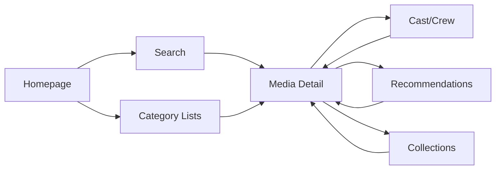

## Overview

Film Fanatic provides multiple pathways for users to discover content, from curated lists on the homepage to detailed media pages with comprehensive information about movies and TV shows.

## Homepage Discovery

The homepage (`src/routes/index.tsx`) serves as the primary entry point for content discovery with several dynamic sections:

### Featured Content Sections

<Tabs>
  <Tab title="Trending">
    Users can switch between:
    - **Today** - Movies trending in the last 24 hours
    - **This Week** - Top trending content over the past week
    
    These tabs allow users to stay current with what's popular.
  </Tab>
  <Tab title="What's Popular">
    Showcases currently popular content in two categories:
    - **Theaters** - Popular movies in cinemas
    - **On TV** - Popular TV shows currently airing
  </Tab>
  <Tab title="Top Rated">
    Features the highest-rated content:
    - **Movies** - All-time top-rated films
    - **TV Shows** - Highest-rated series
  </Tab>
  <Tab title="Upcoming">
    Displays movies scheduled for future release, helping users plan what to watch next.
  </Tab>
</Tabs>

### Search Bar

A prominent search bar appears at the top of the homepage with:
- Real-time search suggestions
- Auto-complete functionality
- Direct navigation to search results page

<Note>
  The search bar uses debounced input to avoid excessive API calls while providing a responsive experience.
</Note>

## Media Detail Pages

When users click on any movie or TV show, they're taken to a comprehensive detail page with multiple sections.

### Movie Detail Page

Location: `src/routes/movie/$id/{-$slug}/index.tsx`

<CardGroup cols={2}>
  <Card title="Title & Metadata" icon="film">
    - Movie title and original title
    - Release year and runtime
    - US certification (PG, R, etc.)
    - IMDb rating and vote count
    - Tagline
  </Card>
  <Card title="Visual Content" icon="image">
    - High-quality poster image
    - Background backdrop
    - Official trailers
    - YouTube clips and teasers
  </Card>
  <Card title="Cast & Crew" icon="users">
    - Top cast members with character names
    - Key crew (director, writers, producers)
    - Link to full cast/crew page
    - Individual person detail pages
  </Card>
  <Card title="Additional Info" icon="info">
    - Plot overview and description
    - Genres with navigation links
    - Keywords for discovery
    - Recommended similar movies
    - Collection membership (if applicable)
  </Card>
</CardGroup>

### TV Show Detail Page

Location: `src/routes/tv/$id/{-$slug}/index.tsx`

TV shows include everything from movies plus:

<Accordion title="Episode Browser">
  An inline accordion-based interface allowing users to:
  - Browse all seasons and episodes
  - View episode thumbnails, titles, and air dates
  - Read episode descriptions
  - See episode ratings
  - Mark episodes as watched (see Episode Tracking)
  - Track viewing progress per episode
  
  Implementation: `src/components/media/inline-episode-browser.tsx`
</Accordion>

<Accordion title="Series-Specific Metadata">
  - Series status (Ended, Canceled, Returning)
  - First air date
  - Number of seasons and total episodes
  - Content rating for TV
  - Episode runtime information
</Accordion>

## Media Recommendation System

Location: `src/components/media/media-recommendation.tsx`

Both movie and TV detail pages feature a recommendations section that suggests similar content based on:
- Genre similarity
- Viewer preferences
- TMDB's recommendation algorithm

<Note>
  Recommendations appear as scrollable cards, allowing users to discover related content without leaving the current page.
</Note>

## Visual Discovery Features

### Poster & Trailer Container

Location: `src/components/media/media-poster-trailer-container.tsx`

This component provides:
- Large poster display
- Embedded trailer player
- Modal video playback
- Automatic trailer selection (official trailers prioritized)

### Media Gallery

Location: `src/components/media/media-container.tsx`

Users can browse:
- **Backdrops** - High-resolution background images
- **Posters** - Official poster variants in different languages
- **Videos** - Trailers, clips, teasers, and featurettes

<CardGroup cols={3}>
  <Card title="Backdrops" icon="photo">
    Scenic shots from the movie/show
  </Card>
  <Card title="Posters" icon="image">
    International poster artwork
  </Card>
  <Card title="Videos" icon="play">
    YouTube trailers and clips
  </Card>
</CardGroup>

## Genre & Keyword Navigation

### Genre Container

Location: `src/components/media/genre-container.tsx`

Each media page displays associated genres as clickable badges:
- Action, Drama, Comedy, etc.
- Clicking navigates to a filtered list of that genre
- Helps users discover similar content by category

### Keywords

Location: `src/components/media/media-keywords.tsx`

Keywords provide granular discovery:
- Specific themes (e.g., "space travel", "revenge")
- Settings or plot elements
- Clickable navigation to related titles

## Cast & Crew Discovery

Location: `src/components/media/cast-section.tsx`

<Tabs>
  <Tab title="Cast">
    - Actor profile photos
    - Character names
    - Link to actor's filmography
    - Top 10 cast members shown by default
  </Tab>
  <Tab title="Crew">
    - Key crew positions (Director, Writer, Producer)
    - Department organization
    - Links to individual crew pages
    - Full crew accessible via "View All" link
  </Tab>
</Tabs>

### Person Pages

Location: `src/routes/person.$id.tsx`

Clicking any cast or crew member navigates to their dedicated page with:
- Biography
- Profile photo
- Complete filmography
- Known works
- Social media links

## Collection Pages

Location: `src/components/media/collections.tsx`

For movies that are part of a collection (e.g., Marvel Cinematic Universe):
- Displays all movies in the collection
- Chronological or release order
- Collection artwork and description
- Easy navigation between collection entries

## User Interaction Points

Throughout the discovery experience, users can:

<CardGroup cols={2}>
  <Card title="Add to Watchlist" icon="bookmark">
    Bookmark content for later viewing using the watchlist button on any media card or detail page.
  </Card>
  <Card title="Share Content" icon="share">
    Share movies and shows via social links (implementation: `src/components/share-button.tsx`).
  </Card>
  <Card title="Watch Trailers" icon="play">
    Play trailers and clips directly in a modal player without leaving the page.
  </Card>
  <Card title="Set Watch Status" icon="check">
    Mark content as watching, completed, or plan to watch (see Watchlist documentation).
  </Card>
</CardGroup>

## Technical Implementation

### Data Source

All media data comes from The Movie Database (TMDB) API:
- Movie details: `src/lib/queries.ts:getMovieDetails()`
- TV details: `src/lib/queries.ts:getTvDetails()`
- Search: `src/lib/queries.ts:getSearchResult()`

### Image Handling

Images are served via TMDB's CDN with different quality tiers:
```typescript
IMAGE_PREFIX.SD_POSTER    // Standard definition posters
IMAGE_PREFIX.SD_BACKDROP  // Standard definition backdrops
IMAGE_PREFIX.HD_POSTER    // High definition posters
```

Location: `src/constants.ts`

### Media Transformations

Raw API data is transformed for consistency:
- `mapGenres()` - Normalizes genre objects
- `mapCast()` - Formats cast with character info
- `mapCrew()` - Organizes crew by department
- `splitVideos()` - Categorizes videos (trailers, clips, etc.)

Location: `src/lib/media-transform.ts`

## Navigation Flow



Users can seamlessly navigate between related content, creating an interconnected discovery experience.